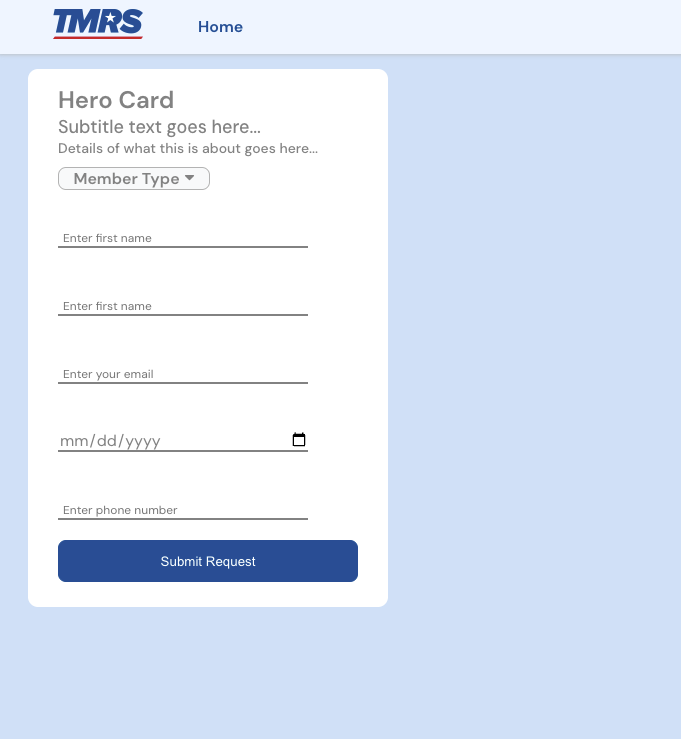

# studio
digital playground to express inspiration.




## Description of the What and Why of this Base App:
- Phase two of the initial hooked up base frontend application based on the modern stack we are moving our applications to. 
- This is configuring dynamic, reusable, DRY (don't repeat yourself) code refactoring and improvement specifically of the typescript type schema using zod api. 
- Those schemas are then passing into all react component files for all stateful and stateless data that is passed from parent-to-child props from the data objects in a readable and scaleable way.

## Acceptance Criteria that this code completes:
- Typescript - Code is complete and/or refactored to adhere to modern DRY (don't repeat yourself) practices specifically of the typescript type models using zod type library for all react components and their corresponding dom data and configs.

- React - Typescript Executable (TSX) React component files are broken down into smallest, reusable files that dynamically and cleanly pass down state and props from parent to child in a readable and easy-to-expand way. Each component file should do one thing and either be stateless or stateful.

- Architecture - Build out and maintain file/folder structure and naming convention for all tsx components, ts models, ts data, sass style, and test files.

- Style - replace any anticipated repeating and configurable hardcoded values into variables and call dynamically

# High Level Code React Typescript Architecture Walk-Through:

- A component is the main function in each . txs file that returns something to the DOM that will be compiled into HTML in the browser
- an example would be a home page component that returns multiple div elements and selectors and also has multiple child components that themselves can return div elements and selectors and other components inside it like a button that returns a returns a link and that link returns a validation message to the user and so on.
- The component folder and file structure is a top down, parent-to-child inheritance of properties (props) and those defined property types.

_This is the parent-to-child folder structure of the components in this application:_
### root > page > section > container > element

_here is one corresponding parent-to-child example for this above structure that is in this code base:_
### App > Home > Hero > Card > Button

- there is only one 'root' component at the top, usually called App.tsx that hoists all it's children's returns up into it's parent, index.html which gets compiled in the browser. 
- The other components can return many children or even sibling components (pages return sections that return containers that return element). 
- Components ideally reusable, passing dynamic properties further down, with children components taking only the dynamic properties they require as arguments and returning those properties back up to the parent based on parent data that are defined at the top parent in a data object. Components can return multiple child components or even sibling components.

## Parent-to-child component structure walk-through:

#### App
is the top parent, or _root_ component, that returns a child _page_ component 'Home' 

#### Home
is a _page_ component that returns two _section_ components 'Hero' and 'Navbar'.

#### Hero
- is a _section_ component that contains an onClick method, two stateful variables, using react hook 'useState()', and also a data object that acts as a map, contains child objects as key/value pairs. 
- This method, variables and data object will  be passed to the _container_ component 'Card'.
- the heroData object is imported from the 'data' folder under file 'heroData.tx'. 
- this data object contains all the stateless (static) data values (properties) that are passed down as what react calls 'props'.
- Since Card and it's child components don't need all the properties defined in the heroData object, we only pass the card data object inside of heroData object and so on, passing only the data props that it needs and then that it's children need.
- This heroData object could easily scale to include multiple child components, containers and elements, or even sibling section components like a sidebar or footer, although generally it's not best practice to nest siblings at this high level. This app  would probably keep them as separate components inside a parent page. Further down the tree of children, containers and elements will use other containers and elements (as a tree trunk to branches have increasingly smaller branches and more of them).

#### Card
- is a _container_ component that returns _element_ components: Input 4 times (two string inputs, one number, and a date) and a Button component
- once again, the only props passed to Input are defined in the input object inside of card object (as defined in the heroData.ts file) and same for Button.

#### Input
- is an _element_ component that returns _html_ elements label and input with and all their selectors. All element and selector values are dynamic and get defined by the property arguments passed to it from it's parent, Card so input object with key "firstName" will only get firstName object values passed to it, the other three Input objects are 'lastName', 'age', and 'dateOfBirth' so those are passed to their input components specifically.

#### Button
- is an _element_ component that is passed not only the button data objects from Card as props, but also the onClick method and two stateful variables. These were first defined up in Hero and have been passed down through Card and now finally in Button where they will be used in the return as values for the html elements and their selectors.

#### Navbar
 - is a _section_ component that returns _element_ component 'Link' two times, each with different dynamic data being passed
 - just like it's sibling section component, Hero, it imports a data object that acts as a map, contains child objects as key/value pairs that will be needed for the child components that Navbar returns
- the data object is imported from the 'data' folder under file 'navbarData.tx'. 
- these data values (properties) are stateless (static) and is passed down as what react calls 'props' to two element components, 'Link'. 
- Since Link and it's child components don't need all the properties defined in the navbarData object, we only pass the link data object inside of navbarData object and so on, passing only the data props that each component needs and  it's children need, so one navbar object link is called 'Home' and the other is called 'Logo'.

#### Link
- is an _element_ component that returns an html <anchor> element, a <label> element and optional element component 'Image' if boolean is defined in the data object that is passing the link object. In our case, the Link component is being passed the link data object as props which is specific to a link object called 'Logo' return a siblling element 'Image' component

#### Image
- is an _element_ component that returns an html  element with all it's required selector values defined by the properties passed to it (src value, alt value...)

## Type Model/Schema
The type schema or Model, is also being passed down with those data object props but need to be defined in each component and called in from the type.ts file.
All static values (such as class and id selectors) in the return section of all the tsx file are not needed to be type defined as typescript can parse these automatically.

# React + Typescript + Vite Official Readme Instructions

This template provides a minimal setup to get React working in Vite with HMR and some ESLint rules.

Currently, two official plugins are available:

- [@vitejs/plugin-react](https://github.com/vitejs/vite-plugin-react/blob/main/packages/plugin-react/README.md) uses [Babel](https://babeljs.io/) for Fast Refresh
- [@vitejs/plugin-react-swc](https://github.com/vitejs/vite-plugin-react-swc) uses [SWC](https://swc.rs/) for Fast Refresh

## Expanding the ESLint configuration

If you are developing a production application, we recommend updating the configuration to enable type aware lint rules:

- Configure the top-level `parserOptions` property like this:

```js
export default tseslint.config({
  languageOptions: {
    // other options...
    parserOptions: {
      project: ['./tsconfig.node.json', './tsconfig.app.json'],
      tsconfigRootDir: import.meta.dirname,
    },
  },
})
```

- Replace `tseslint.configs.recommended` to `tseslint.configs.recommendedTypeChecked` or `tseslint.configs.strictTypeChecked`
- Optionally add `...tseslint.configs.stylisticTypeChecked`
- Install [eslint-plugin-react](https://github.com/jsx-eslint/eslint-plugin-react) and update the config:

```js
// eslint.config.js
import react from 'eslint-plugin-react'

export default tseslint.config({
  // Set the react version
  settings: { react: { version: '18.3' } },
  plugins: {
    // Add the react plugin
    react,
  },
  rules: {
    // other rules...
    // Enable its recommended rules
    ...react.configs.recommended.rules,
    ...react.configs['jsx-runtime'].rules,
  },
})
```
